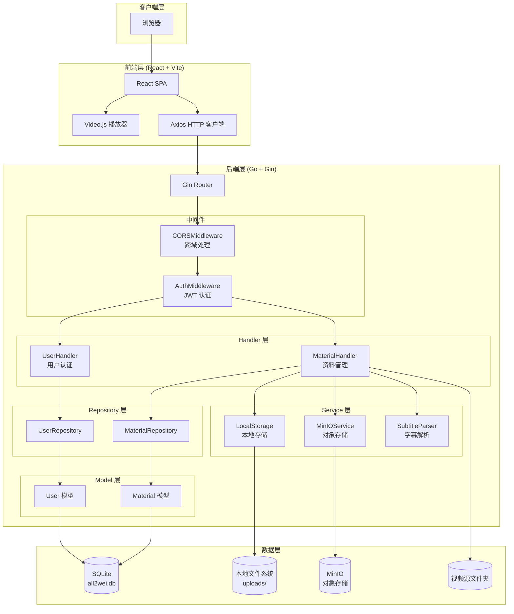
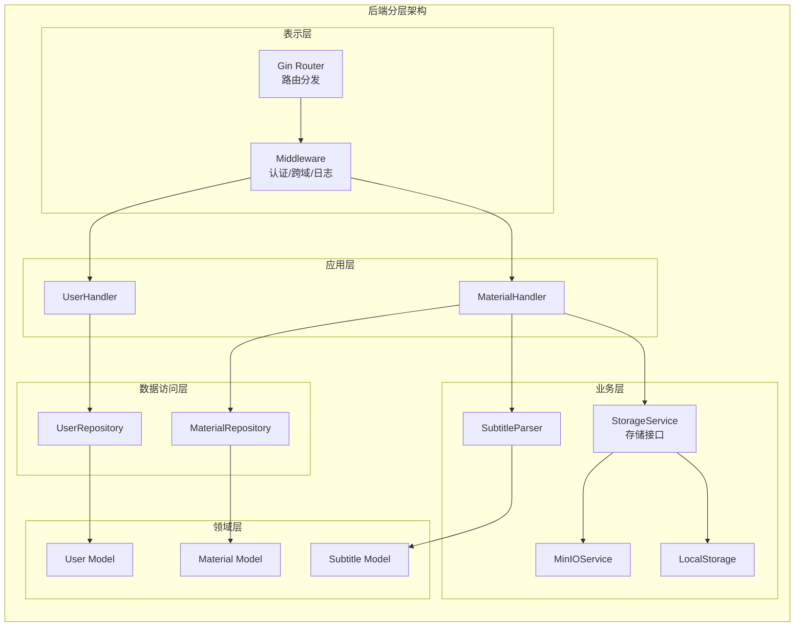
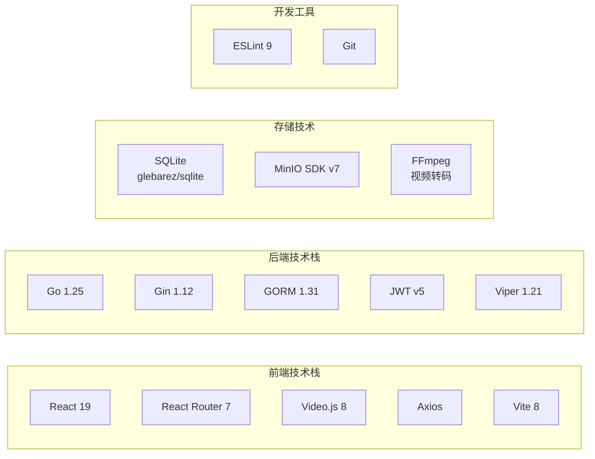
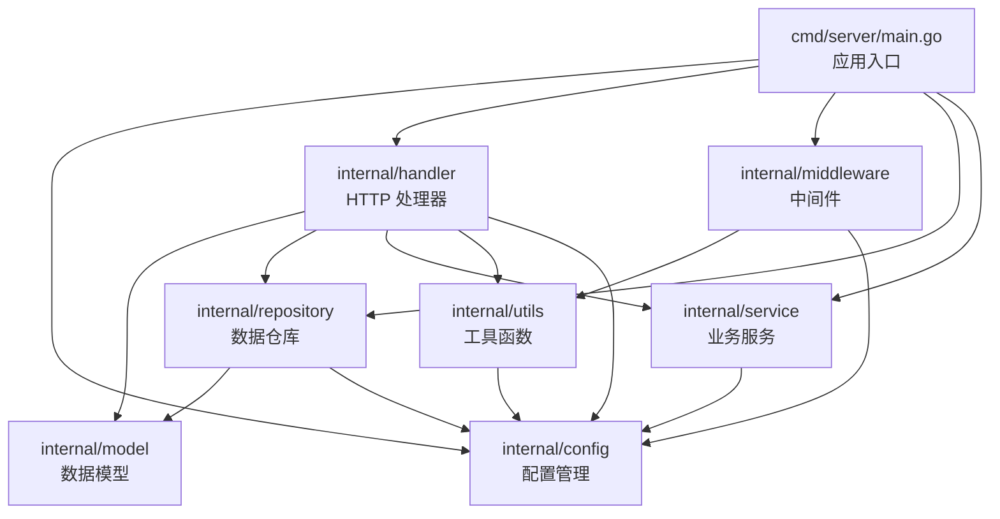

# All2Wei 项目架构文档

## 1. 系统架构图

```mermaid
graph TB
    subgraph Client["客户端层"]
        Browser["浏览器"]
    end

    subgraph Frontend["前端层 (React + Vite)"]
        ReactApp["React SPA"]
        VideoJS["Video.js 播放器"]
        Axios["Axios HTTP 客户端"]
    end

    subgraph Backend["后端层 (Go + Gin)"]
        Router["Gin Router"]
        
        subgraph Handlers["Handler 层"]
            UserHandler["UserHandler<br/>用户认证"]
            MaterialHandler["MaterialHandler<br/>资料管理"]
        end
        
        subgraph Middleware["中间件"]
            AuthMW["AuthMiddleware<br/>JWT 认证"]
            CORSMW["CORSMiddleware<br/>跨域处理"]
        end
        
        subgraph Services["Service 层"]
            LocalStorage["LocalStorage<br/>本地存储"]
            MinIOService["MinIOService<br/>对象存储"]
            SubtitleParser["SubtitleParser<br/>字幕解析"]
        end
        
        subgraph Repositories["Repository 层"]
            UserRepo["UserRepository"]
            MaterialRepo["MaterialRepository"]
        end
        
        subgraph Models["Model 层"]
            User["User 模型"]
            Material["Material 模型"]
        end
    end

    subgraph Data["数据层"]
        SQLite[("SQLite<br/>all2wei.db")]
        LocalFS[("本地文件系统<br/>uploads/")]
        MinIO[("MinIO<br/>对象存储")]
        VideoSource[("视频源文件夹")]
    end

    Browser --> ReactApp
    ReactApp --> VideoJS
    ReactApp --> Axios
    Axios --> Router
    
    Router --> CORSMW
    CORSMW --> AuthMW
    AuthMW --> UserHandler
    AuthMW --> MaterialHandler
    
    UserHandler --> UserRepo
    MaterialHandler --> MaterialRepo
    MaterialHandler --> LocalStorage
    MaterialHandler --> MinIOService
    MaterialHandler --> SubtitleParser
    
    UserRepo --> User
    MaterialRepo --> Material
    User --> SQLite
    Material --> SQLite
    
    LocalStorage --> LocalFS
    MinIOService --> MinIO
    MaterialHandler --> VideoSource
```

## 2. 后端分层架构图

```mermaid
graph LR
    subgraph LayeredArchitecture["后端分层架构"]
        direction TB
        
        subgraph Presentation["表示层"]
            Router["Gin Router<br/>路由分发"]
            MW["Middleware<br/>认证/跨域/日志"]
        end
        
        subgraph Application["应用层"]
            UH["UserHandler"]
            MH["MaterialHandler"]
        end
        
        subgraph Business["业务层"]
            SS["StorageService<br/>存储接口"]
            MIS["MinIOService"]
            LS["LocalStorage"]
            SP["SubtitleParser"]
        end
        
        subgraph DataAccess["数据访问层"]
            UR["UserRepository"]
            MR["MaterialRepository"]
        end
        
        subgraph Domain["领域层"]
            UM["User Model"]
            MM["Material Model"]
            SM["Subtitle Model"]
        end
    end
    
    Router --> MW
    MW --> UH
    MW --> MH
    UH --> UR
    MH --> MR
    MH --> SS
    SS --> MIS
    SS --> LS
    MH --> SP
    UR --> UM
    MR --> MM
    SP --> SM
```

## 3. 技术栈图

```mermaid
graph LR
    subgraph FrontendTech["前端技术栈"]
        React["React 19"]
        Router["React Router 7"]
        VideoJS["Video.js 8"]
        Axios["Axios"]
        Vite["Vite 8"]
    end
    
    subgraph BackendTech["后端技术栈"]
        Go["Go 1.25"]
        Gin["Gin 1.12"]
        GORM["GORM 1.31"]
        JWT["JWT v5"]
        Viper["Viper 1.21"]
    end
    
    subgraph StorageTech["存储技术"]
        SQLite["SQLite<br/>glebarez/sqlite"]
        MinIO["MinIO SDK v7"]
        FFmpeg["FFmpeg<br/>视频转码"]
    end
    
    subgraph DevTools["开发工具"]
        ESLint["ESLint 9"]
        Git["Git"]
    end
```

## 4. 模块依赖关系图

```mermaid
graph TD
    Main["cmd/server/main.go<br/>应用入口"]
    
    Config["internal/config<br/>配置管理"]
    Handler["internal/handler<br/>HTTP 处理器"]
    Middleware["internal/middleware<br/>中间件"]
    Model["internal/model<br/>数据模型"]
    Repository["internal/repository<br/>数据仓库"]
    Service["internal/service<br/>业务服务"]
    Utils["internal/utils<br/>工具函数"]
    
    Main --> Config
    Main --> Handler
    Main --> Middleware
    Main --> Repository
    Main --> Service
    
    Handler --> Model
    Handler --> Repository
    Handler --> Service
    Handler --> Utils
    Handler --> Config
    
    Middleware --> Utils
    Middleware --> Config
    
    Repository --> Model
    Repository --> Config
    
    Service --> Config
    
    Utils --> Config
```

