# All2Wei 其他图表文档

## 1. 数据流图 (DFD)

### 1.1 上下文数据流图 (Level 0)

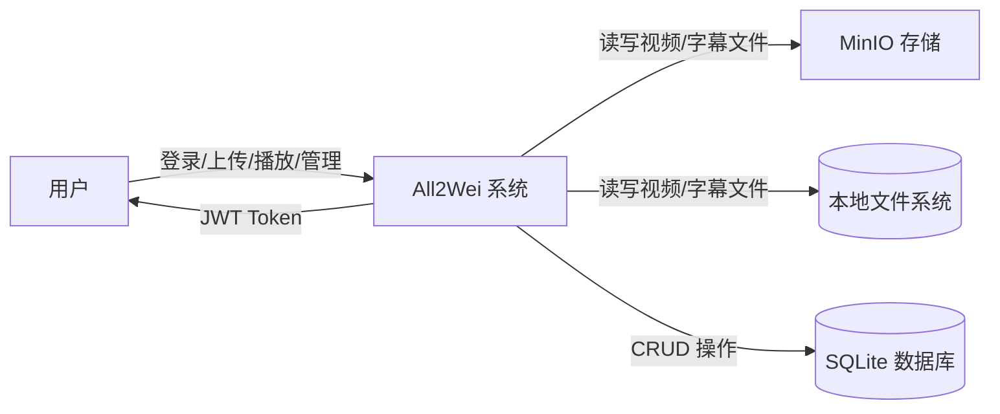

### 1.2 一级数据流图 (Level 1)

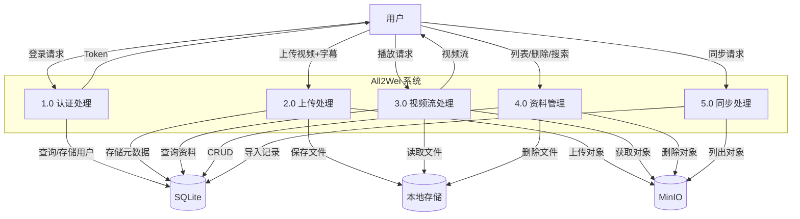

## 2. 实体关系图 (ER Diagram)

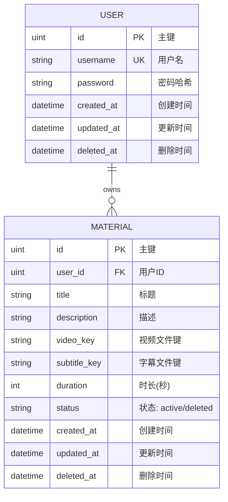

## 3. 部署图

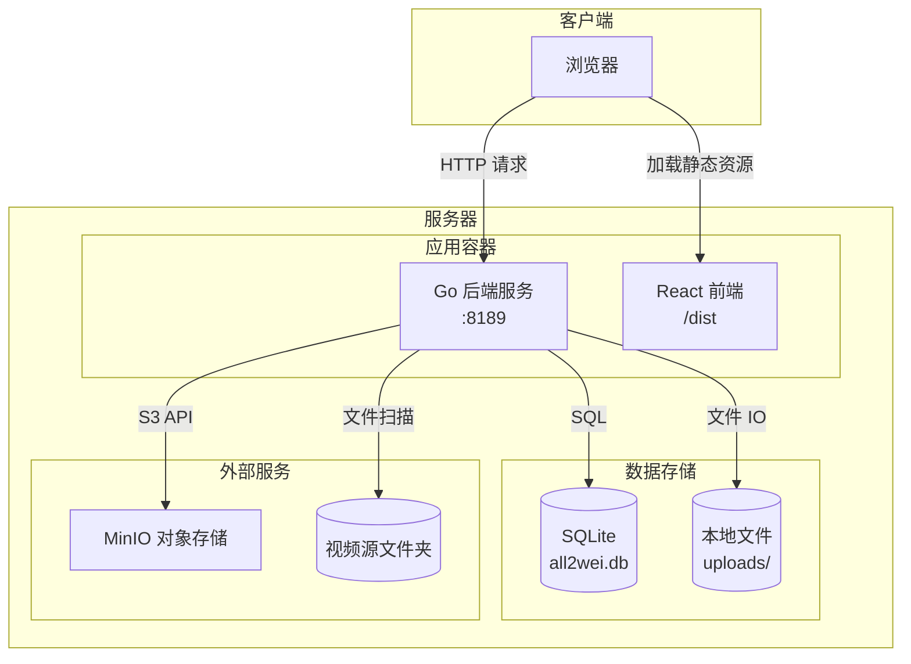

## 4. 状态图

### 4.1 视频资料状态图

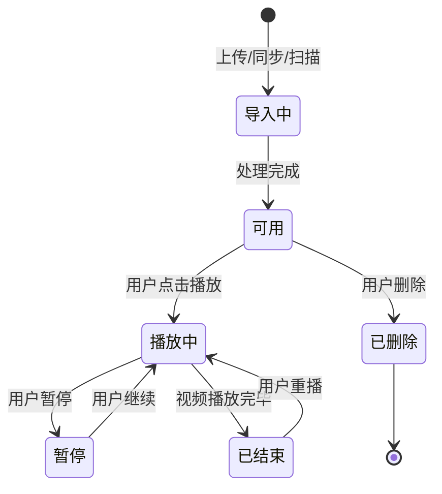

### 4.2 用户认证状态图

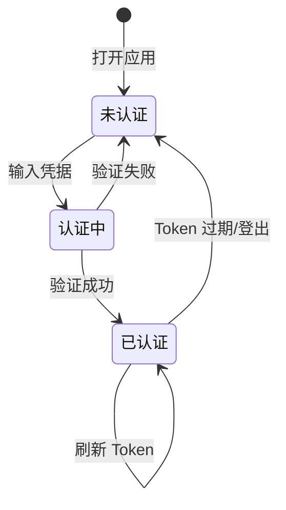

## 5. 用例图

```mermaid
graph TB
    actor User as 普通用户
    
    subgraph All2Wei["All2Wei 系统"]
        UC1["登录系统"]
        UC2["上传视频"]
        UC3["播放视频"]
        UC4["查看字幕"]
        UC5["搜索字幕"]
        UC6["管理资料"]
        UC7["同步 MinIO"]
        UC8["扫描视频源"]
    end
    
    User --> UC1
    User --> UC2
    User --> UC3
    User --> UC4
    User --> UC5
    User --> UC6
    User --> UC7
    User --> UC8
    
    UC2 -.->|"包含"| UC4
    UC3 -.->|"包含"| UC4
    UC3 -.->|"扩展"| UC5
    UC6 -.->|"包含"| UC2
    UC6 -.->|"包含"| UC7
    UC6 -.->|"包含"| UC8
```

## 6. 组件图

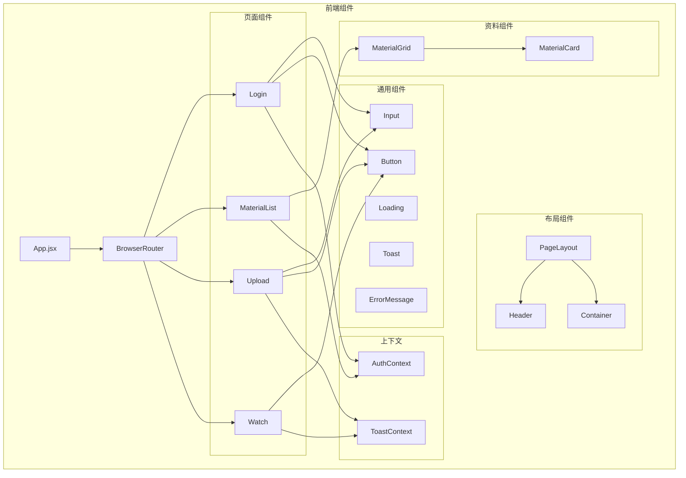

## 7. 活动图 - 视频上传流程

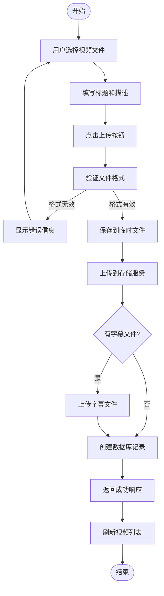

## 8. 活动图 - 视频播放流程

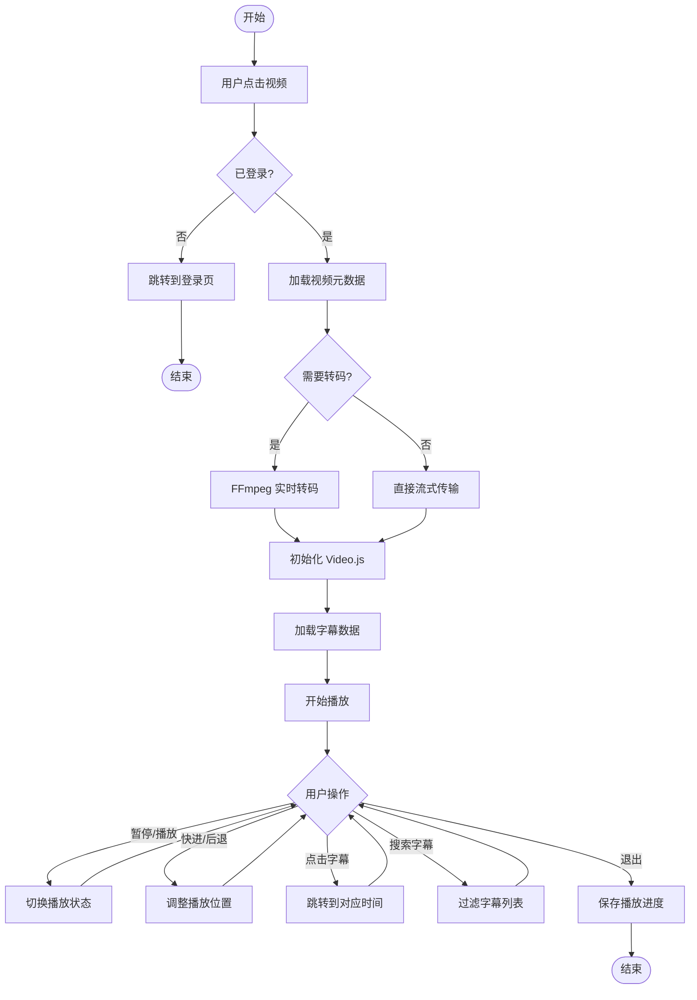

## 9. 类图

### 9.1 后端核心类图

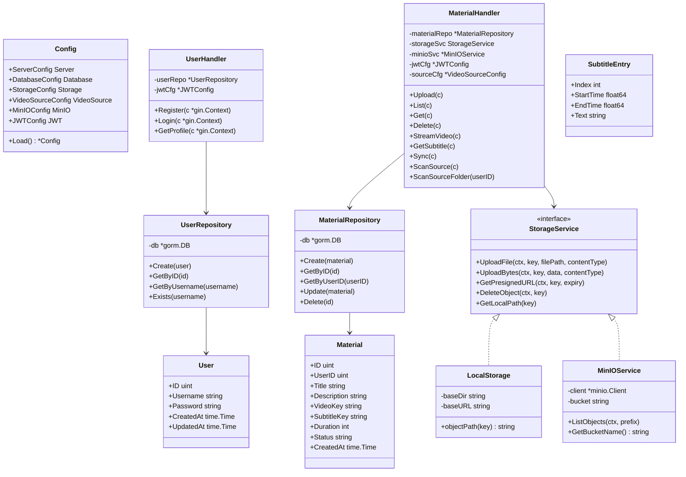

### 9.2 前端核心类图

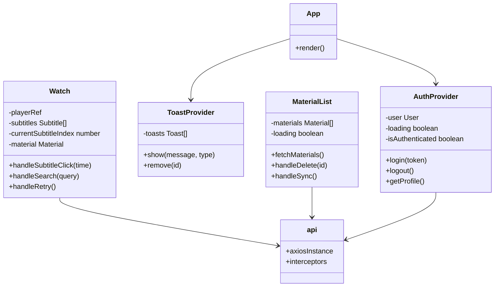

