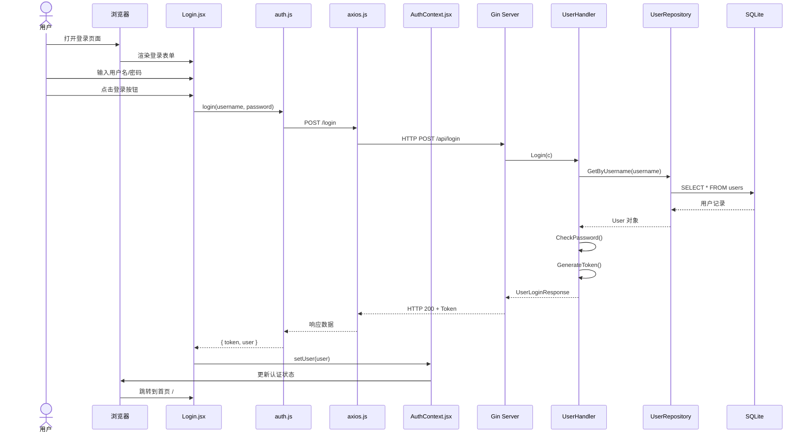
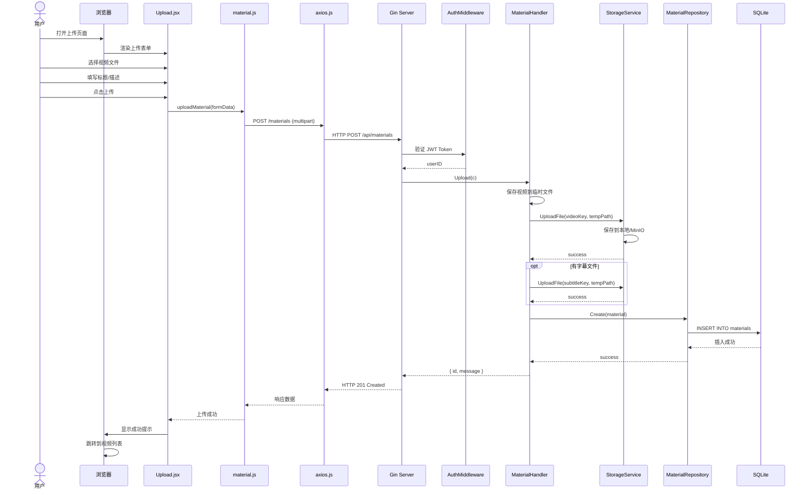
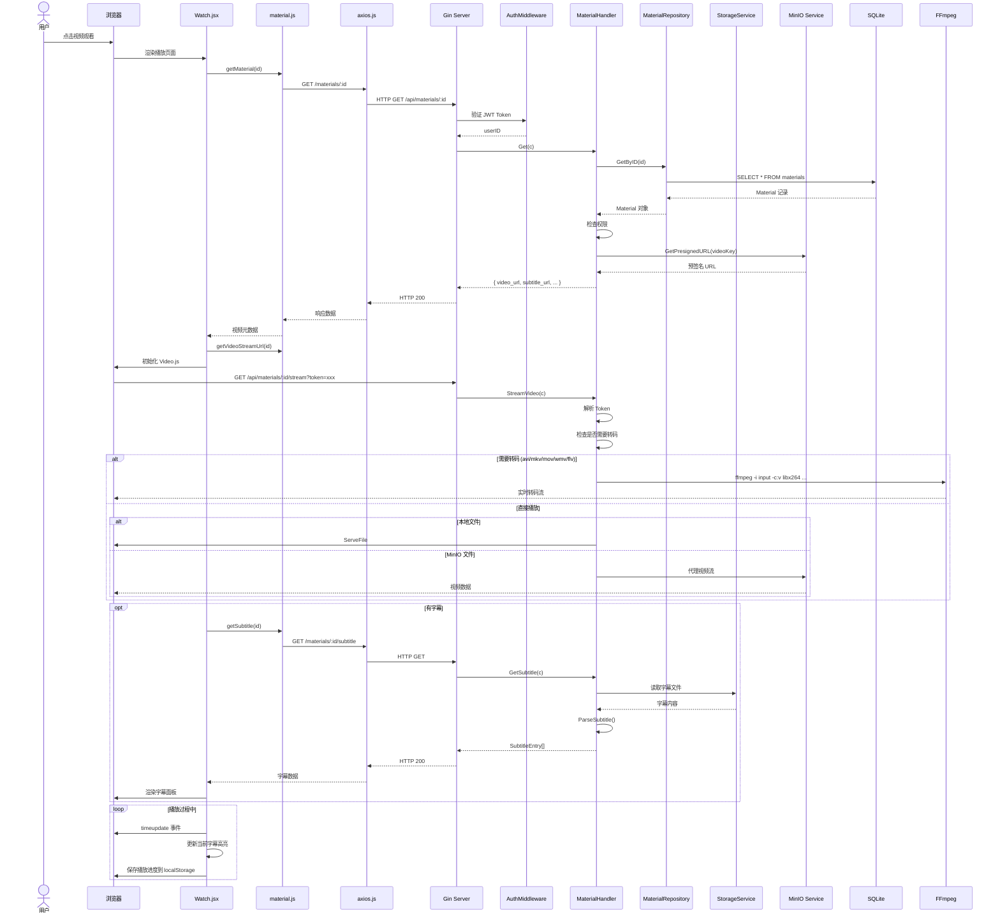
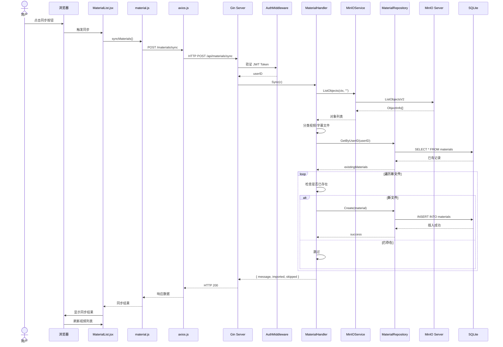
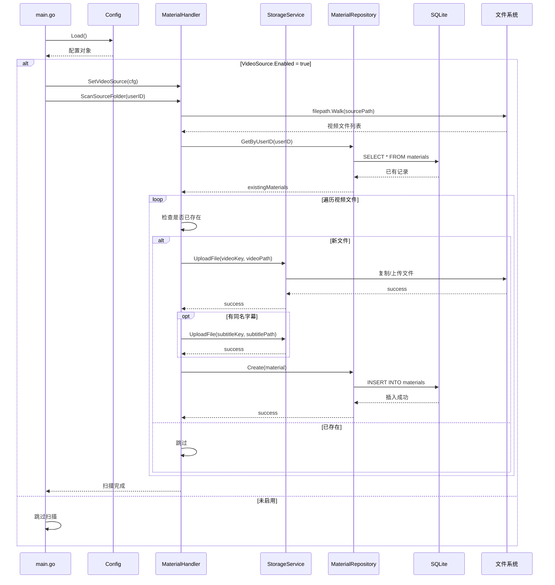
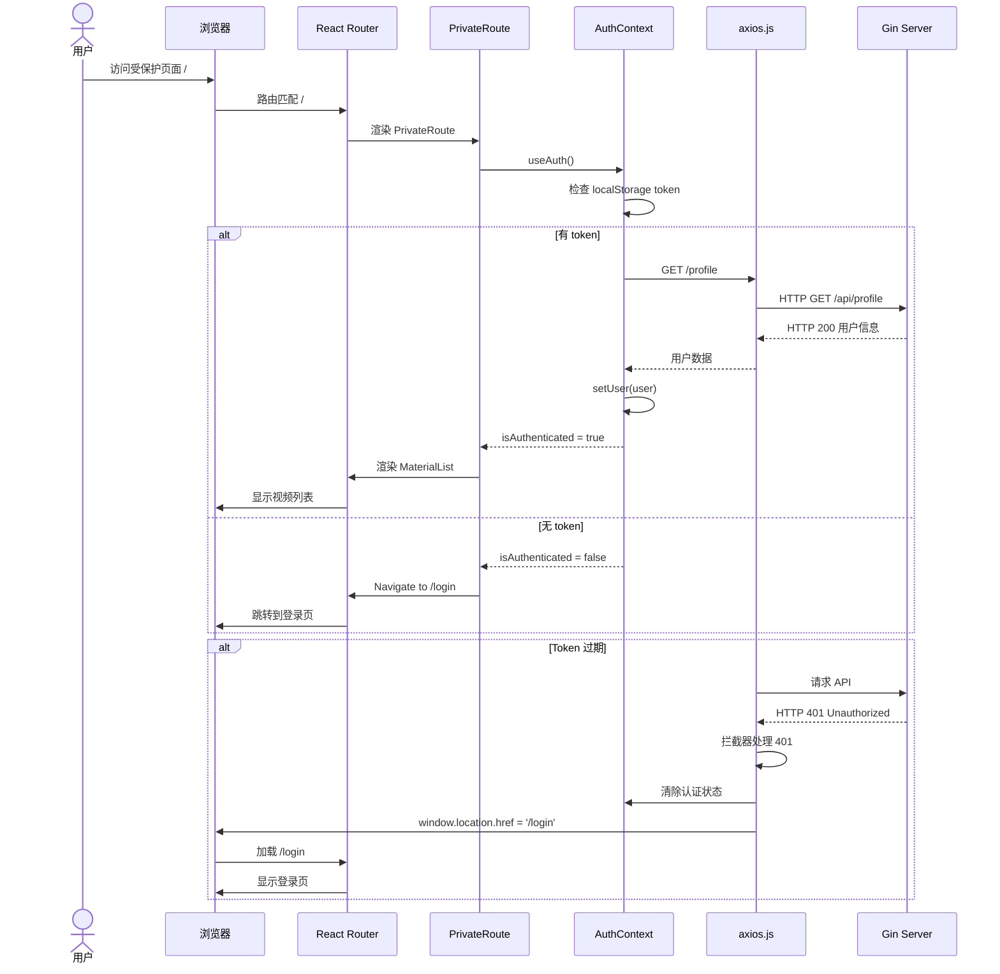

# All2Wei 时序图文档

## 1. 用户登录时序图

```mermaid
sequenceDiagram
    actor User as 用户
    participant Browser as 浏览器
    participant LoginPage as Login.jsx
    participant AuthAPI as auth.js
    participant Axios as axios.js
    participant AuthContext as AuthContext.jsx
    participant Server as Gin Server
    participant UserHandler as UserHandler
    participant UserRepo as UserRepository
    participant SQLite as SQLite

    User->>Browser: 打开登录页面
    Browser->>LoginPage: 渲染登录表单
    User->>LoginPage: 输入用户名/密码
    User->>LoginPage: 点击登录按钮
    LoginPage->>AuthAPI: login(username, password)
    AuthAPI->>Axios: POST /login
    Axios->>Server: HTTP POST /api/login
    Server->>UserHandler: Login(c)
    UserHandler->>UserRepo: GetByUsername(username)
    UserRepo->>SQLite: SELECT * FROM users
    SQLite-->>UserRepo: 用户记录
    UserRepo-->>UserHandler: User 对象
    UserHandler->>UserHandler: CheckPassword()
    UserHandler->>UserHandler: GenerateToken()
    UserHandler-->>Server: UserLoginResponse
    Server-->>Axios: HTTP 200 + Token
    Axios-->>AuthAPI: 响应数据
    AuthAPI-->>LoginPage: { token, user }
    LoginPage->>AuthContext: setUser(user)
    AuthContext->>Browser: 更新认证状态
    Browser->>LoginPage: 跳转到首页 /
```

## 2. 视频上传时序图

```mermaid
sequenceDiagram
    actor User as 用户
    participant Browser as 浏览器
    participant UploadPage as Upload.jsx
    participant MaterialAPI as material.js
    participant Axios as axios.js
    participant Server as Gin Server
    participant AuthMW as AuthMiddleware
    participant MaterialHandler as MaterialHandler
    participant StorageSvc as StorageService
    participant MaterialRepo as MaterialRepository
    participant SQLite as SQLite

    User->>Browser: 打开上传页面
    Browser->>UploadPage: 渲染上传表单
    User->>UploadPage: 选择视频文件
    User->>UploadPage: 填写标题/描述
    User->>UploadPage: 点击上传
    UploadPage->>MaterialAPI: uploadMaterial(formData)
    MaterialAPI->>Axios: POST /materials (multipart)
    Axios->>Server: HTTP POST /api/materials
    Server->>AuthMW: 验证 JWT Token
    AuthMW-->>Server: userID
    Server->>MaterialHandler: Upload(c)
    MaterialHandler->>MaterialHandler: 保存视频到临时文件
    MaterialHandler->>StorageSvc: UploadFile(videoKey, tempPath)
    StorageSvc->>StorageSvc: 保存到本地/MinIO
    StorageSvc-->>MaterialHandler: success
    opt 有字幕文件
        MaterialHandler->>StorageSvc: UploadFile(subtitleKey, tempPath)
        StorageSvc-->>MaterialHandler: success
    end
    MaterialHandler->>MaterialRepo: Create(material)
    MaterialRepo->>SQLite: INSERT INTO materials
    SQLite-->>MaterialRepo: 插入成功
    MaterialRepo-->>MaterialHandler: success
    MaterialHandler-->>Server: { id, message }
    Server-->>Axios: HTTP 201 Created
    Axios-->>MaterialAPI: 响应数据
    MaterialAPI-->>UploadPage: 上传成功
    UploadPage->>Browser: 显示成功提示
    Browser->>Browser: 跳转到视频列表
```

## 3. 视频播放时序图

```mermaid
sequenceDiagram
    actor User as 用户
    participant Browser as 浏览器
    participant WatchPage as Watch.jsx
    participant MaterialAPI as material.js
    participant Axios as axios.js
    participant Server as Gin Server
    participant AuthMW as AuthMiddleware
    participant MaterialHandler as MaterialHandler
    participant MaterialRepo as MaterialRepository
    participant StorageSvc as StorageService
    participant MinIO as MinIO Service
    participant SQLite as SQLite
    participant FFmpeg as FFmpeg

    User->>Browser: 点击视频观看
    Browser->>WatchPage: 渲染播放页面
    WatchPage->>MaterialAPI: getMaterial(id)
    MaterialAPI->>Axios: GET /materials/:id
    Axios->>Server: HTTP GET /api/materials/:id
    Server->>AuthMW: 验证 JWT Token
    AuthMW-->>Server: userID
    Server->>MaterialHandler: Get(c)
    MaterialHandler->>MaterialRepo: GetByID(id)
    MaterialRepo->>SQLite: SELECT * FROM materials
    SQLite-->>MaterialRepo: Material 记录
    MaterialRepo-->>MaterialHandler: Material 对象
    MaterialHandler->>MaterialHandler: 检查权限
    MaterialHandler->>MinIO: GetPresignedURL(videoKey)
    MinIO-->>MaterialHandler: 预签名 URL
    MaterialHandler-->>Server: { video_url, subtitle_url, ... }
    Server-->>Axios: HTTP 200
    Axios-->>MaterialAPI: 响应数据
    MaterialAPI-->>WatchPage: 视频元数据

    WatchPage->>MaterialAPI: getVideoStreamUrl(id)
    WatchPage->>Browser: 初始化 Video.js
    Browser->>Server: GET /api/materials/:id/stream?token=xxx
    Server->>MaterialHandler: StreamVideo(c)
    MaterialHandler->>MaterialHandler: 解析 Token
    MaterialHandler->>MaterialHandler: 检查是否需要转码
    alt 需要转码 (avi/mkv/mov/wmv/flv)
        MaterialHandler->>FFmpeg: ffmpeg -i input -c:v libx264 ...
        FFmpeg-->>Browser: 实时转码流
    else 直接播放
        alt 本地文件
            MaterialHandler->>Browser: ServeFile
        else MinIO 文件
            MaterialHandler->>MinIO: 代理视频流
            MinIO-->>Browser: 视频数据
        end
    end

    opt 有字幕
        WatchPage->>MaterialAPI: getSubtitle(id)
        MaterialAPI->>Axios: GET /materials/:id/subtitle
        Axios->>Server: HTTP GET
        Server->>MaterialHandler: GetSubtitle(c)
        MaterialHandler->>StorageSvc: 读取字幕文件
        StorageSvc-->>MaterialHandler: 字幕内容
        MaterialHandler->>MaterialHandler: ParseSubtitle()
        MaterialHandler-->>Server: SubtitleEntry[]
        Server-->>Axios: HTTP 200
        Axios-->>WatchPage: 字幕数据
        WatchPage->>Browser: 渲染字幕面板
    end

    loop 播放过程中
        WatchPage->>Browser: timeupdate 事件
        WatchPage->>WatchPage: 更新当前字幕高亮
        WatchPage->>Browser: 保存播放进度到 localStorage
    end
```

## 4. MinIO 同步时序图

```mermaid
sequenceDiagram
    actor User as 用户
    participant Browser as 浏览器
    participant MaterialList as MaterialList.jsx
    participant MaterialAPI as material.js
    participant Axios as axios.js
    participant Server as Gin Server
    participant AuthMW as AuthMiddleware
    participant MaterialHandler as MaterialHandler
    participant MinIOService as MinIOService
    participant MaterialRepo as MaterialRepository
    participant MinIO as MinIO Server
    participant SQLite as SQLite

    User->>Browser: 点击同步按钮
    Browser->>MaterialList: 触发同步
    MaterialList->>MaterialAPI: syncMaterials()
    MaterialAPI->>Axios: POST /materials/sync
    Axios->>Server: HTTP POST /api/materials/sync
    Server->>AuthMW: 验证 JWT Token
    AuthMW-->>Server: userID
    Server->>MaterialHandler: Sync(c)
    MaterialHandler->>MinIOService: ListObjects(ctx, "")
    MinIOService->>MinIO: ListObjectsV2
    MinIO-->>MinIOService: ObjectInfo[]
    MinIOService-->>MaterialHandler: 对象列表
    MaterialHandler->>MaterialHandler: 分类视频/字幕文件
    MaterialHandler->>MaterialRepo: GetByUserID(userID)
    MaterialRepo->>SQLite: SELECT * FROM materials
    SQLite-->>MaterialRepo: 已有记录
    MaterialRepo-->>MaterialHandler: existingMaterials

    loop 遍历新文件
        MaterialHandler->>MaterialHandler: 检查是否已存在
        alt 新文件
            MaterialHandler->>MaterialRepo: Create(material)
            MaterialRepo->>SQLite: INSERT INTO materials
            SQLite-->>MaterialRepo: 插入成功
            MaterialRepo-->>MaterialHandler: success
        else 已存在
            MaterialHandler->>MaterialHandler: 跳过
        end
    end

    MaterialHandler-->>Server: { message, imported, skipped }
    Server-->>Axios: HTTP 200
    Axios-->>MaterialAPI: 响应数据
    MaterialAPI-->>MaterialList: 同步结果
    MaterialList->>Browser: 显示同步结果
    Browser->>MaterialList: 刷新视频列表
```

## 5. 视频源文件夹扫描时序图

```mermaid
sequenceDiagram
    participant Main as main.go
    participant Config as Config
    participant MaterialHandler as MaterialHandler
    participant StorageSvc as StorageService
    participant MaterialRepo as MaterialRepository
    participant SQLite as SQLite
    participant FS as 文件系统

    Main->>Config: Load()
    Config-->>Main: 配置对象
    alt VideoSource.Enabled = true
        Main->>MaterialHandler: SetVideoSource(cfg)
        Main->>MaterialHandler: ScanSourceFolder(userID)
        MaterialHandler->>FS: filepath.Walk(sourcePath)
        FS-->>MaterialHandler: 视频文件列表
        MaterialHandler->>MaterialRepo: GetByUserID(userID)
        MaterialRepo->>SQLite: SELECT * FROM materials
        SQLite-->>MaterialRepo: 已有记录
        MaterialRepo-->>MaterialHandler: existingMaterials

        loop 遍历视频文件
            MaterialHandler->>MaterialHandler: 检查是否已存在
            alt 新文件
                MaterialHandler->>StorageSvc: UploadFile(videoKey, videoPath)
                StorageSvc->>FS: 复制/上传文件
                FS-->>StorageSvc: success
                StorageSvc-->>MaterialHandler: success
                opt 有同名字幕
                    MaterialHandler->>StorageSvc: UploadFile(subtitleKey, subtitlePath)
                    StorageSvc-->>MaterialHandler: success
                end
                MaterialHandler->>MaterialRepo: Create(material)
                MaterialRepo->>SQLite: INSERT INTO materials
                SQLite-->>MaterialRepo: 插入成功
                MaterialRepo-->>MaterialHandler: success
            else 已存在
                MaterialHandler->>MaterialHandler: 跳过
            end
        end
        MaterialHandler-->>Main: 扫描完成
    else 未启用
        Main->>Main: 跳过扫描
    end
```

## 6. 前端路由守卫时序图

```mermaid
sequenceDiagram
    actor User as 用户
    participant Browser as 浏览器
    participant Router as React Router
    participant PrivateRoute as PrivateRoute
    participant AuthContext as AuthContext
    participant Axios as axios.js
    participant Server as Gin Server

    User->>Browser: 访问受保护页面 /
    Browser->>Router: 路由匹配 /
    Router->>PrivateRoute: 渲染 PrivateRoute
    PrivateRoute->>AuthContext: useAuth()
    AuthContext->>AuthContext: 检查 localStorage token
    alt 有 token
        AuthContext->>Axios: GET /profile
        Axios->>Server: HTTP GET /api/profile
        Server-->>Axios: HTTP 200 用户信息
        Axios-->>AuthContext: 用户数据
        AuthContext->>AuthContext: setUser(user)
        AuthContext-->>PrivateRoute: isAuthenticated = true
        PrivateRoute->>Router: 渲染 MaterialList
        Router->>Browser: 显示视频列表
    else 无 token
        AuthContext-->>PrivateRoute: isAuthenticated = false
        PrivateRoute->>Router: Navigate to /login
        Router->>Browser: 跳转到登录页
    end

    alt Token 过期
        Axios->>Server: 请求 API
        Server-->>Axios: HTTP 401 Unauthorized
        Axios->>Axios: 拦截器处理 401
        Axios->>AuthContext: 清除认证状态
        Axios->>Browser: window.location.href = '/login'
        Browser->>Router: 加载 /login
        Router->>Browser: 显示登录页
    end
```

